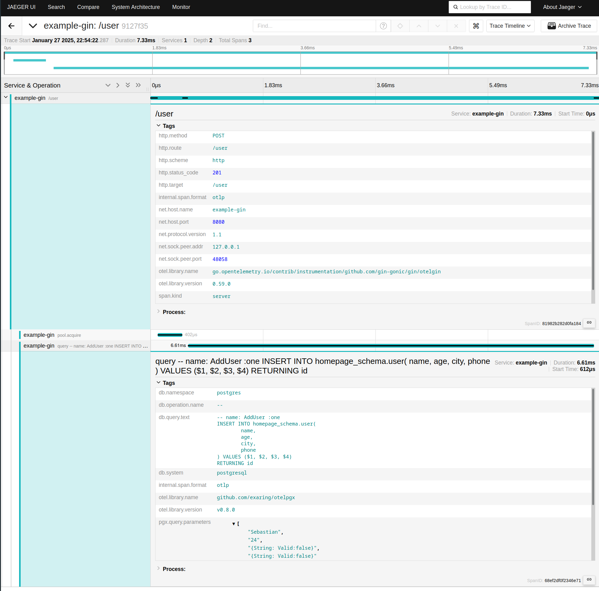

# An example Gin Go project

## Description

A boilerplate project for a Gin webserver.
Idea is to follow best practices and have a good starting point for any
project which involves one of the following or all of them:

* **PostgreSQL** database access with **sqlc**
* Local PostgreSQL integration tests
* **Gin Gonic** Web server
* Additional yet useful static code analysis with **golangci-lint**
* Have a nice structured logging with tracing offered by **Zerolog**
* Enable **OpenTelemetry** tracing for better view on performance insights

Example logging with Zerolog middleware hooked to Gin Gonic:

```json
{"level":"info","uniq_id":"a05830c0","time":"2022-12-18T23:03:26+02:00","caller":"example-gin/cmd/webserver/main.go:38","message":"test"}
{"level":"info","client_ip":"127.0.0.1","uniq_id":"a05830c0","method":"GET","status_code":200,"body_size":23,"path":"/get/asdf","latency":"6.185µs","time":"2022-12-18T23:03:33+02:00"}
```

Example screenshot of OTEL tracing captured and shown in Jeager UI:


## Prerequisites

* [Docker](https://docker-docs.netlify.app/install/) acting as a local development database and for integration tests.
  Also a step towards reproducible builds.
* [Gin](https://gin-gonic.com/) as a web framework.
* [Golangci-lint](https://golangci-lint.run/) for linting and static code analysis.
* [govulncheck](https://go.dev/security/vuln/) for package vulnerability analysis.
* [Goose](https://github.com/pressly/goose) for database migrations.
* [sqlc](https://sqlc.dev/) for database access.
* [Zerolog](https://zerolog.io/) for structured and leveled logging.

## Features

* Logging has an unique ID `uniq_id` column that can be used to track
  log events in clustered application and other places where same service
  has many instances.
* Graceful shutdown for HTTP server and for the database connections.
  * Useful with Lambdas or with AWS Fargate where signal handling speeds up
    the shutdown.
* Database retry with exponential backoff and connection pooling.
* Gin middlewares for logging and database.
* Enable OpenTelemetry tracing with Gin Gonic integration by default.
* Live performance statistics and profiling via separate web service (pprof HTTP server)
* No logging for certain routes/paths (currently /health and /metrics).

## Usage

### Install package dependencies

Type `make install-dependencies` to retrieve Go packages needed by the project.

### Demoing usage

```bash
make stop-db start-db build-webserver
export $(grep -v "^#" .env |xargs)
./target/webserver_linux_amd64 &
./t.sh
```

### Adding new database migrations

This expects `goose` to be installed and it can be found from the `$PATH`:

```bash
make name=create-shop migrate-add
```

The newly added migration can be found under [sql/schemas/](sql/schemas/).

## TODO

* Create separate unprivileged API users for Postgres access
* Add an example of proper database transaction cancellation with Golang's cancel
